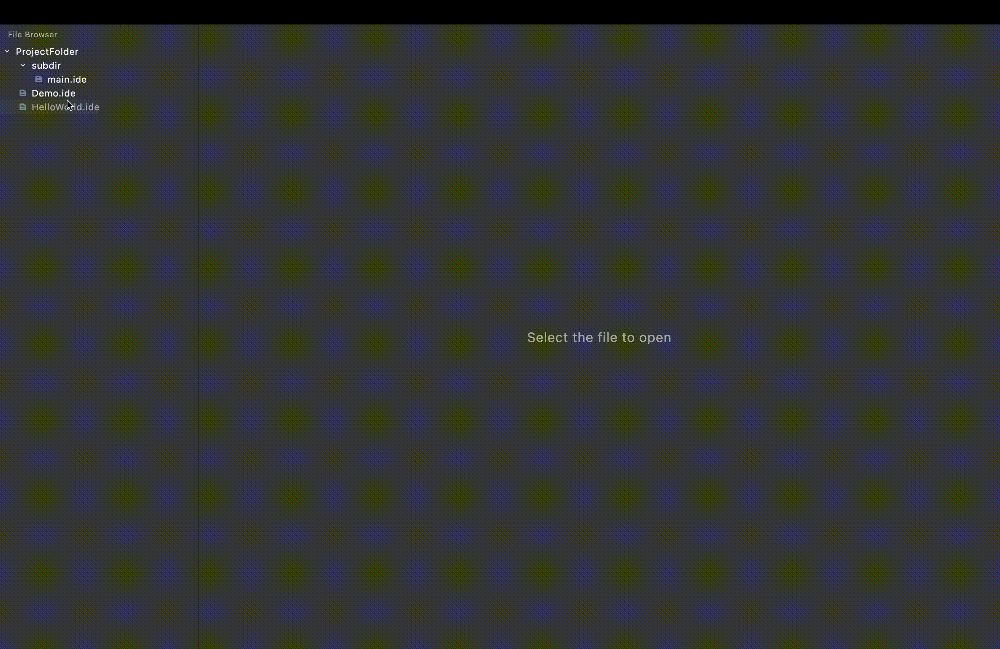

## IDE development project
### Simple and minimalistic code editor for IDELang

### Demo


### Building and running instructions
```
./gradlew run
```

### Features

#### Editing features
* Text editing
* Syntax highlighting 
* Text selection
* Hotkeys for copying, pasting, cutting text and saving files

#### File browsing
* Interactive sidebar with file tree
  * Opening file from the file tree
  * File tree stays up to date with the file system
* Working with multiple tabs

### Implementation details

**Data structure for text representation:** Rope

**UI Framework:** Jetpack Compose
